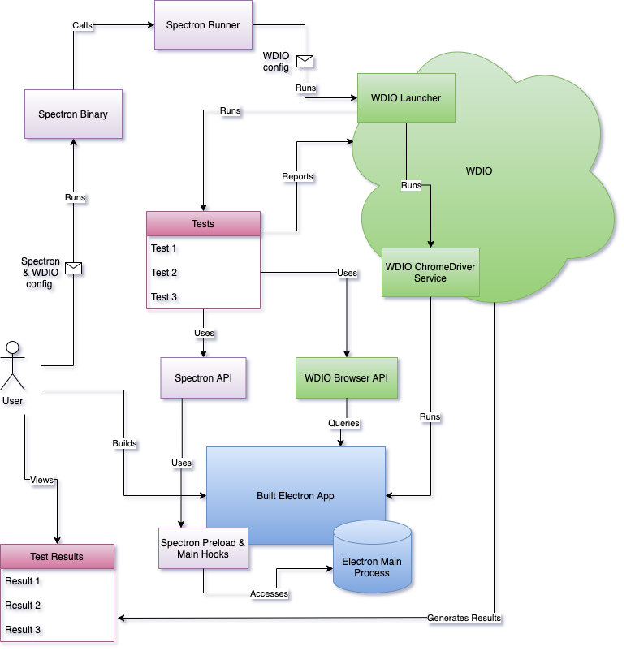

## Architecture

Spectron is effectively a wrapper around WebdriverIO (WDIO) and its Chromedriver service, with some custom hooks for accessing Electron APIs.

### Basic Workflow

1. The user builds an Electron app using Spectron hooks
2. The user runs Spectron, passing the path to a configuration file
3. Spectron runner reads the configuration file, strips out the Spectron-specific values and uses the remaining values to construct a configuration for WDIO
4. Spectron runner creates a WDIO launcher with the configuration
5. WDIO launcher runs the WDIO Chromedriver service which executes the Electron binary of the app
6. WDIO launcher runs the tests
7. Test code can query the Electron APIs of the app through the Spectron API, and the DOM via the WDIO browser API
8. Test results are reported to WDIO
9. WDIO relays test results to the user

### Diagram

